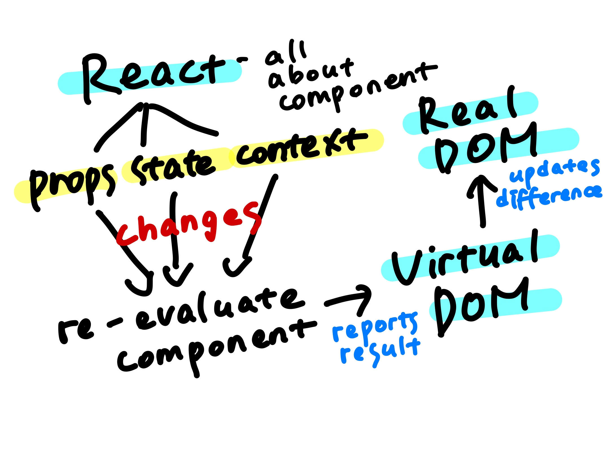

# 리액트 최적화 테크닉

## 리액트 작동 방식



부모 state 변화 -> 부모 컴포넌트 재평가 -> 자식 컴포넌트들도 재평가

=> 변화가 없는 자식 컴포넌트까지 굳이 재평가를 해야하나 ㅇㅅㅇ

## React.memo()

- 함수형 컴포넌트에만 가능

- 컴포넌트의 props가 바뀌지 않으면 재평가 하지마라

```react
export default React.memo(Component);
```

- 최적화도 비용이다
  == 컴포넌트의 기존 props를 기억하는 공간, 상위 컴포넌트가 재평가될때 해당 컴포넌트 재평가 할지말지 결정하는 행동까지 다 비용이 듬
  => memo도 선택적으로 하기, 확정적으로 변하거나 불변하는 경우 할 필요가 없음 

- 자스는 원시값이면 같다고 평가하지만 참조값은 같다고 평가하지 않음
  => 상위 컴포넌트 재실행시 컴포넌트 내 함수도 재실행 == 기존 props의 함수랑 같은 함수가 아님, 재평가됨

```react
function App() {
  
  const [showParagraph, setShowParagraph] = useState(false);

  const paragraphHandler = () => {
    setShowParagraph((s) => !s);
  }

  return (
    <div className="app">
      <h1>Hi there!</h1>
      <DemoOutput show={false} />
      <!-- memo해도 함수 props는 재평가됨 -->
      <Button onClick={paragraphHandler}>toggle paragraph!</Button>
    </div>
  );
}
```

## useCallback()

- 함수 재평가 방지
- 변하지 않을 함수, 의존성 배열

```react
import { useCallback } from 'react';

// allowToggle이 변할 시에만 함수 재평가
const paragraphHandler = useCallback(() => {
    if (allowToggle) {
      setShowParagraph((s) => !s);
    }
  }, [allowToggle]);
```

## State 관리

- 상태 변화 -> 상태 변화 스케쥴링 -> 적절한 순서에 따라 상태 업데이트 -> 컴포넌트 재평가

- 동시에 여러 개의 상태 변화가 예약될 수 있으므로 상태 변화는 함수 형태를 이용해 갱신하는걸로

```react
const paragraphHandler = useCallback(() => {
    if (allowToggle) {
      setShowParagraph((s) => !s);
    }
  }, [allowToggle]);
```

- 하나의 함수 내에서 여러 개의 상태 업데이트를 수행하면 리액트는 이를 하나의 작업으로 수행 

## useMemo()

- 참조값은 매번 재평가될때마다 다른 주소에 생성되므로 재평가 -> 함수를 기억해도 함수의 매개변수는 변함 -> 값 자체를 기억해버리기
- 정렬같이 함수에 성능이 많이 요구되는 경우에 쓸 수 있음

```react
const { items } = props;

const sortedList = useMemo(() => {
    return items.sort();
}, [items])
```

```react
<DemoList items={useMemo(() => [4, 32, 3, 1, 5], [])}></DemoList>
```

